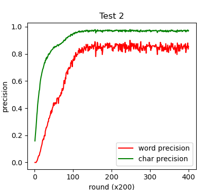

# pytorch-crf
使用条件随机场（CRF）解决OCR任务的pytorch实现。

## 算法描述
接下来的推导中，数学符号的定义均基于《统计学习方法》11.2.3中的符号定义。具体而言，我们将所有的特征及其权值使用统一的符号表示，分别记为$f_k(y_{i-1}, y_i, x, i)$和$w_k$，其中$k=1,2,3,...,K$。

由此定义全局特征向量$F(y, x)$和权重向量$w$
$$F(y, x)=\left(f_1(y, x), f_2(y, x), ...,f_K(y, x)\right)^\top$$
$$w=\left(w_1, w_2, ..., w_K\right)^\top$$

于是条件随机场可表示为如下简化形式
$$
\begin{aligned}
    P(y|x)=&=\frac 1{Z(x)}\exp(w^\top F(y, x))\\
    Z(x)&=\sum_{y'}\exp(w^\top F(y', x))
\end{aligned}
$$

### 对数似然与梯度
给定数据集$\mathcal{D}=\{(x^{1}, y^{1}), ..., (x^{j}, y^{j}), ...(x^{J}, y^{J})\}$，对数似然函数为
$$
\begin{aligned}
    LL(\mathcal{D})&= \log \prod_{j=1}^J P(y^{j}|x^{j})\\
    &=\sum_{j=1}^Jw^\top F(y^{j}, x^{j})-\log Z(x^{j})\\
\end{aligned}
$$
对参数$w$求导，得到
$$
\begin{aligned}
    \frac {\partial LL(\mathcal{D})}{\partial w} &= \sum_{j=1}^J\left(F(y^j, x^j)-\frac 1{Z(x^j)}\frac {\partial Z(x^j)}{\partial w}\right)\\
    &=\sum_{j=1}^J\left(F(y^j, x^j)-\frac 1{Z(x^j)}\sum_{y'}\exp(w^\top F(y', x^j))F(y', x^j)\right)\\
    &=\sum_{j=1}^J\left(F(y^j, x^j)-\sum_{y'}P(y'|x^j)F(y', x^j)\right)\\
    &=\sum_{j=1}^J\left(F(y^j, x^j)-\mathbb{E}_{y'\sim P(y'|x^j)}\left[F(y', x^j)\right]\right)\\
\end{aligned}
$$

从上面的推导过程可以看出，对数似然对参数$w$的导数的方向，与样本特征函数与其特征函数期望之差的方向相同。在使用梯度上升算法对梯度进行更新后，特征函数的期望$\mathbb{E}_{y'\sim P(y'|x^j)}\left[F(y', x^j)\right]$会向$F(y^j, x^j)$靠近。

### 学习算法
本项目使用梯度上升算法对参数$w$进行优化。参数学习算法分为两个步骤，第一步是求解对数似然，第二步是计算梯度。
  + **求解对数似然**
    求解对数似然部分我使用的是《统计学习方法》一书11.3.1章的前向后向算法。假设序列长度为$n$，该算法首先需要计算概率矩阵$M_i, i=1, 2, ..., n+1$，然后定义前向向量$\alpha_i(\cdot|x)$，其第$i$个元素表示位置$i$的标记是$y_i$并且从$1$到$i$的前部分标记序列的非规范化概率。基于动态规划算法，可使用迭代式$\alpha^\top_i(\cdot|x)=\alpha^\top_{i-1} (\cdot|x)M_i$计算得到最后一个位置的前向向量$\alpha_n(\cdot|x)$。此时规范化因子可通过$Z(x)=\mathbf{1}^\top \alpha_n(\cdot|x)$求得。
    求得$Z(x)$后，代入式(\ref{eq0})即可得到对数似然函数。
  + **计算梯度**
    上面给出了一个求解梯度的计算式，但是式中需要对所有可能的$y'$进行遍历，这一操作的复杂度随序列长度成指数型增长。我在实际实现时使用了pytorch对参数$w$进行自动微分。

### 模型解码
+ 在求解得到模型参数后，可使用维特比算法求解给定观察$x$的最可能状态序列$y^*$。
+ 这里用到的维特比算法与《统计学习方法》231-233页叙述的内容完全一致，在此仅作简要描述。
+ 定义维特比变量$\delta_i(l)$和备忘录变量$\Phi_i(l)$为
$$
\begin{aligned}
    \delta_i(l)=\max_{1\leq j\leq m}\{\delta_{i-1}(j)+w^\top F_i(y_{i-1}=j, y_i=l, x)\}\quad\quad l=1,2,...,m\\
    \Phi_i(l) = \arg\max \{\delta_{i-1}(j)+w^\top F_i(y_{i-1}=j, y_i=l, x)\}\quad\quad l=1,2,...,m\\
\end{aligned}
$$
分别表示从第一个位置到位置$i$的各个标记$l=1,2,...,m$的非规范化概率的最大值和最大值路径。易见维特比变量可使用动态规划算法进行迭代求解。
+ 求得最后一个位置的维特比变量后，只需根据最大的概率值回溯路径即可得到最可能路径。

---

## 项目描述
目录中包含三个.py文件，其中utils.py定义数据加载相关的函数；feature\_functions.py实现了三种特征函数，并为它们实现了统一的调用接口；CRF.py为主要模块，其中定义了用于实现OCR识别的类CRF\_OCR。

运行方式为：在根目录下，执行命令`python3 src/CRF.py`，即可开始加载数据集、训练并在测试集上进行测试。

## 结果

